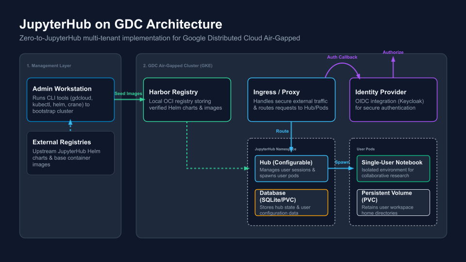

# Jupyter Notebooks with JupyterHub on GDC-ag<br/>Reference Implementation

## Overview

This solution outlines deploying a self-managed JupyterHub platform on GDC
air-gapped. The proposed self-managed JupyterHub architecture delivers a
scalable, multi-tenant environment where each project is provisioned with an
isolated Hub instance, ensuring robust per-tenant security and isolation. The
core infrastructure components include JupyterHub, Google Kubernetes Engine
(GKE) for orchestration, a Harbor registry for custom image management, OIDC for
authentication, and Persistent Volumes (PVCs) for workspace data retention. This
high-level strategy unblocks key capability gaps by allowing teams to deploy
arbitrary user-supplied container images and select flexible hardware resource
allocations (CPU, GPU, and RAM) at session startup.

## Architecture



### Management Environment

The management environment is responsible for the initial preparation and
staging of software artifacts. Within this layer, an Administrative (Admin)
Workstation , referred to as the "Workstation" in the guide, utilizes tools like
to seed container images and Helm charts from external sources into a local
artifact registry, ensuring that all required software is fully available within
the air-gapped environment before deployment begins.

- Administrative Workstation \[Workstation\]

### Google Distributed Cloud Air-Gapped (GDC-ag) Environment

The GDC air-gapped environment provides the secure infrastructure required to
host the self-managed JupyterHub platform. Within this isolated layer, a
standard cluster is deployed alongside a local Harbor registry instance to
securely manage projects and stage container images.

- Standard Cluster
- Harbor registry instance
  - Project

### JupyterHub Environment

The JupyterHub environment delivers a scalable, multi-tenant platform where each
project is provisioned with an isolated Hub instance. This setup ensures robust
per-tenant security and isolation while allowing teams to select flexible
hardware resource allocations at session startup.

- Hub
- Proxy
- Notebook

## Before you Begin

Before proceeding with the deployment, ensure that your environment meets all
necessary prerequisites and that the required command-line utilities are
properly configured. Setting up these tools on your workstation is essential for
managing container registries, interacting with clusters, and automating the
deployment process.

### Environment Configuration

#### Identity and Access Management (IAM)

- The following IAM roles are required for the GDC project:

  - **Cluster Admin**
  - **Harbor Instance Viewer**

#### Artifact Registry (Harbor)

- [Create Harbor registry instances | Google Distributed Cloud air-gapped](https://docs.cloud.google.com/distributed-cloud/hosted/docs/latest/gdcag/platform-application/pa-ao-operations/create-harbor-instances)
- [Create Harbor projects | Google Distributed Cloud air-gapped](https://docs.cloud.google.com/distributed-cloud/hosted/docs/latest/gdcag/platform-application/pa-ao-operations/create-harbor-projects)

- The following role is required on the Harbor project for the user account:

  - **Developer**

- The following permissions are required on the Harbor project for the image
  pull robot account:

  - **List Repository**
  - **Pull Repository**
  - **Read Artifact**
  - **List Artifact**
  - **List Tag**

- [Create Project Robot Accounts | Harbor Documentation](https://goharbor.io/docs/2.14.0/working-with-projects/project-configuration/create-robot-accounts/#add-a-robot-account)

### Workstation

This guide requires a workstation with the necessary connectivity to the
environment.

The following information about the environment is required for the Workstation
Configuration:

- `ARTIFACT_REGISTRY_URL`: The URL of the artifact registry (e.g.
  `artifact-registry.example.com`)
- `ARTIFACT_REGISTRY_PROJECT_NAME`: The namespace or project name to use in the
  artifact registry (e.g. `jupyter`)
- `ARTIFACT_REGISTRY_ACCOUNT_NAME`: The name of the artifact registry account to
  use for pulling images.
- `ARTIFACT_REGISTRY_ACCOUNT_TOKEN`: The authentication token for the artifact
  registry account above.
- `GDC_CLUSTER_NAME`: The name of the GDC cluster.
- `GDC_PROJECT`: The name of the GDC project.
- `GDC_ZONE:` The name of the GDC deployment zone.

#### Requirements

The following tools need to be installed on the workstation:

- **`crane`**: manage and copy container images between registries
  ([documentation](https://github.com/google/go-containerregistry/tree/main/cmd/crane)).
- **`gdcloud`**: Command-line interface (CLI) for managing Google Distributed
  Cloud (GDC) resources
  ([documentation](https://docs.cloud.google.com/distributed-cloud/hosted/docs/latest/gdch/resources/gdcloud-download)).
- **`kubectl`**: Command-line interface (CLI) used to communicate with and
  manage a Kubernetes cluster.
- **`helm`**: package manager for Kubernetes used to deploy the Envoy and AI
  Gateway charts
- **`jq`**: lightweight and flexible command-line JSON processor.
- **`python`**: high-level, general-purpose programming language renowned for
  its simple, English-like syntax and exceptional readability.
- **`yq`**: portable command-line YAML processor.

All tasks that start with **\[Workstation\]** are intended to be run from the
workstation.

#### Workstation Configuration

- \[Workstation\] Clone the solution repository.

  ```shell
  git clone https://github.com/GoogleCloudPlatform/gdc-solutions.git \
  --depth 1 \
  --filter=blob:none \
  --sparse \
  ${HOME}/gdc-solutions && \
  cd ${HOME}/gdc-solutions && \
  git sparse-checkout set air-gapped/jupyter-notebooks/jupyterhub
  cd air-gapped/jupyter-notebooks/jupyterhub
  ```

- \[Workstation\] Edit the environment file with the values for your
  environment. Open the following file with your preferred editor.

  ```shell
  ${HOME}/gdc-solutions/air-gapped/jupyter-notebooks/jupyterhub/shell.env
  ```

- \[Workstation\] Source the environment file.

  ```shell
  source ${HOME}/gdc-solutions/air-gapped/jupyter-notebooks/jupyterhub/shell.env
  ```

> [!IMPORTANT]  
> Any time a new terminal or shell is started, the environment file needs to be
> sourced.

- \[Workstation\] Verify the environment variables have been set.

  ```shell
  echo "GDC_SOLUTION_HOME=${GDC_SOLUTION_HOME}"
  ```

### Cluster

- \[Workstation\] Retrieve cluster credentials.

  ```shell
  gdcloud clusters get-credentials ${GDC_CLUSTER_NAME} \
  --project="${GDC_CLUSTER_PROJECT}" \
  --standard \
  --zone="${GDC_CLUSTER_ZONE}"
  ```

- \[Workstation\] Verify connectivity to the cluster.

  ```shell
  kubectl cluster-info
  ```

## **Artifact Migration**

- \[Workstation\] Verify connectivity and configuration for the artifact
  registry.

  - [Configure Docker to trust the Harbor root CA | Google Distributed Cloud air-gapped](https://docs.cloud.google.com/distributed-cloud/hosted/docs/latest/gdcag/platform-application/pa-ao-operations/configure-docker-trust)
  - [Sign in to Docker and Helm | Google Distributed Cloud air-gapped](https://docs.cloud.google.com/distributed-cloud/hosted/docs/latest/gdcag/platform-application/pa-ao-operations/configure-docker-authentication)
  - [Push an image | Google Distributed Cloud air-gapped](https://docs.cloud.google.com/distributed-cloud/hosted/docs/latest/gdcag/platform-application/pa-ao-operations/push-image)

- \[Workstation\] Add the jupyterhub Helm repository.

  ```shell
  helm repo add jupyterhub https://hub.jupyter.org/helm-chart/
  helm repo update
  ```

- \[Workstation\] Pull the jupyterhub Helm chart.

  ```shell
  helm pull jupyterhub/jupyterhub \
  --destination="${GDC_SOLUTION_HOME}" \
  --version=${JUPYTERHUB_HELM_CHART_VERSION}
  ```

- \[Workstation\] Push OCI image of the Helm chart to the artifact registry.

  ```shell
  helm push \
  "${GDC_SOLUTION_HOME}/jupyterhub-${JUPYTERHUB_HELM_CHART_VERSION}.tgz" \
  oci://${ARTIFACT_REGISTRY_URI}/helm-chart/
  ```

- \[Workstation\] Seed the required container images to the artifact registry.

  ```shell
  # Define an array of required container images for the solution
  declare -a images=($(helm template jupyterhub/jupyterhub --version=${JUPYTERHUB_HELM_CHART_VERSION} | yq -r '..|.image? | select(.)' | sort -u))
  (IFS=$'\n'; echo "${images[*]}")

  # Iterate through the array and migrate each image to the local registry
  for source_image in "${images[@]}"; do
    # Extract the image path and define the destination URI
    image_path="${source_image#*/}"
    destination_image="${ARTIFACT_REGISTRY_URI}/${image_path}"

    # Execute the migration using crane
    crane copy "${source_image}" "${destination_image}"
  done
  ```

## Implementation

### Database Deployment

The database is deployed using the default for the Helm chart. The deployment
used SQLite and a `PersistentVolumeClaim` (PVC). A PostgreSQL database can be
used and the scaffolding configuration is present in the
`jupyterhub-values.yaml` values file. The deployment of a PostgreSQL database is
not covered in this guide.

For more information see:
[Configuration Reference — Zero to JupyterHub with Kubernetes documentation](https://z2jh.jupyter.org/en/latest/resources/reference.html#hub-db)

- **Helm Default:** `sqlite-pvc`
- PostgreSQL
  - Managed PostgreSQL/AlloyDB
  - Deploy self managed PostgreSQL in cluster

### JupyterHub Deployment

- \[Workstation\] Create the namespace

  ```shell
  kubectl create namespace "${JUPYTERHUB_NAMESPACE}"
  ```

- \[Workstation\] Create the `imagePullSecret`.

  ```shell
  kubectl create secret docker-registry "${ARTIFACT_REGISTRY_IMAGE_PULL_SECRET_NAME}" \
  --docker-password="${ARTIFACT_REGISTRY_ACCOUNT_TOKEN}" \
  --docker-server="${ARTIFACT_REGISTRY_URL}" \
  --docker-username="${ARTIFACT_REGISTRY_ACCOUNT_NAME}" \
  --dry-run=client \
  --namespace="${JUPYTERHUB_NAMESPACE}" \
  --output=yaml | kubectl apply -f -
  ```

- \[Workstation\] Run the `generate_ca_chain.sh` script to generate the GDC SSL
  CA chain.

  ```shell
  "${GDC_SOLUTION_HOME}/scripts/generate_ca_chain.sh"
  ```

- \[Workstation\] Generate the JupyterHub Helm chart values file.

  ```shell
  envsubst < "${GDC_SOLUTION_HOME}/templates/jupyterhub-values.tmpl.yaml" \
  | sponge "${GDC_SOLUTION_HOME}/jupyterhub-values.yaml"
  ```

- \[Workstation\] Review jupyterhub Helm chart values file.

  ```shell
  less "${GDC_SOLUTION_HOME}/jupyterhub-values.yaml"
  ```

- \[Workstation\] Render the jupyterhub Helm chart manifests.

  ```shell
  helm template jupyterhub oci://${ARTIFACT_REGISTRY_URI}/helm-chart/jupyterhub \
  --namespace="${JUPYTERHUB_NAMESPACE}" \
  --post-renderer="${GDC_SOLUTION_HOME}/scripts/gdc-post-renderer.py" \
  --values="${GDC_SOLUTION_HOME}/jupyterhub-values.yaml" \
  --version="${JUPYTERHUB_HELM_CHART_VERSION}" > "${GDC_SOLUTION_HOME}/jupyterhub-manifests.yaml"
  ```

- \[Workstation\] Review the Kubernetes manifests in the
  `jupyterhub-manifests.yaml` file.

  ```shell
  less "${GDC_SOLUTION_HOME}/jupyterhub-manifests.yaml"
  ```

- \[Workstation\] Install the jupyterhub Helm chart.

  ```shell
  helm upgrade --cleanup-on-fail \
  --install jupyterhub oci://${ARTIFACT_REGISTRY_URI}/helm-chart/jupyterhub \
  --namespace="${JUPYTERHUB_NAMESPACE}" \
  --post-renderer="${GDC_SOLUTION_HOME}/scripts/gdc-post-renderer.py" \
  --values="${GDC_SOLUTION_HOME}/jupyterhub-values.yaml" \
  --version="${JUPYTERHUB_HELM_CHART_VERSION}"
  ```

### Validation

- \[Workstation\] Verify the `Pod`s are `Running.`

  ```shell
  kubectl get pod \
  --namespace=${JUPYTERHUB_NAMESPACE}
  ```

- \[Workstation\] Get the `EXTERNAL-IP` for the `proxy-public` `Service`.

  ```shell
  kubectl get service/proxy-public \
  --namespace=${JUPYTERHUB_NAMESPACE}
  ```

- (Optional) \[Workstation\] Set up port forwarding.

  ```shell
  kubectl port-forward service/proxy-public 8080:http \
  --namespace=${JUPYTERHUB_NAMESPACE}
  ```

- \[Web Browser\] Login to the JupyterHub UI.

### Operations

#### Profiles

You can create configurations for multiple user environments, and let users
select from them once they log in to your JupyterHub. This is done by creating
multiple profiles, each of which is attached to a set of configuration options
that override your JupyterHub’s default configuration (specified in your Helm
Chart). This can be used to let users choose among many container images, to
select the hardware on which they want their jobs to run, or to configure
default interfaces.

For more information see
[Customizing User Environment — JupyterHub with Kubernetes documentation](https://z2jh.jupyter.org/en/latest/jupyterhub/customizing/user-environment.html#using-multiple-profiles-to-let-users-select-their-environment)

#### Container Images

Project Jupyter maintains the
[jupyter/docker-stacks repository](https://github.com/jupyter/docker-stacks/),
which contains ready to use container images. Each image includes a set of
commonly used science and data science libraries and tools. They also provide
excellent documentation on
[how to choose a suitable image](https://jupyter-docker-stacks.readthedocs.io/en/latest/using/selecting.html)

For more information see
[Customizing User Environment — JupyterHub with Kubernetes documentation](https://z2jh.jupyter.org/en/latest/jupyterhub/customizing/user-environment.html#)

#### User Management

For more information see
[Customizing User Management — JupyterHub with Kubernetes documentation](https://z2jh.jupyter.org/en/latest/jupyterhub/customizing/user-management.html)

#### Configuration Changes

- \[Workstation\] Modify the `jupyterhub-values.yaml` configuration file. You
  can pull the current release values, see
  [Troubleshooting: Helm Values](#helm-values)
- \[Workstation\] Apply the configuration changes.

  ```shell
  source ${HOME}/gdc-solutions/air-gapped/jupyter-notebooks/jupyterhub/shell.env && \
  helm upgrade --cleanup-on-fail \
  --install jupyterhub oci://${ARTIFACT_REGISTRY_URI}/helm-chart/jupyterhub \
  --namespace="${JUPYTERHUB_NAMESPACE}" \
  --post-renderer="${GDC_SOLUTION_HOME}/scripts/gdc-post-renderer.py" \
  --values="${GDC_SOLUTION_HOME}/jupyterhub-values.yaml" \
  --version="${JUPYTERHUB_HELM_CHART_VERSION}"
  ```

### Troubleshooting

#### Helm Values

To get the values of the current release, use the following command:

```shell
source ${HOME}/gdc-solutions/air-gapped/jupyter-notebooks/jupyterhub/shell.env && \
helm get values jupyterhub \
--namespace="${JUPYTERHUB_NAMESPACE}" > "${GDC_SOLUTION_HOME}/jupyterhub-values-helm-get.yaml"
```

### Clean up

- \[Workstation\] Uninstall the jupyterhub Helm chart.

  ```shell
  source ${HOME}/gdc-solutions/air-gapped/jupyter-notebooks/jupyterhub/shell.env && \
  helm uninstall jupyterhub \
  --namespace=${JUPYTERHUB_NAMESPACE}
  ```

- \[Workstation\] Check for any remaining resources.

  ```shell
  source ${HOME}/gdc-solutions/air-gapped/jupyter-notebooks/jupyterhub/shell.env && \
  kubectl get all \
  --namespace=${JUPYTERHUB_NAMESPACE}
  ```

- \[Workstation\] Delete any remaining resources.

  ```shell
  source ${HOME}/gdc-solutions/air-gapped/jupyter-notebooks/jupyterhub/shell.env && \
  kubectl delete all \
  --all \
  --namespace=${JUPYTERHUB_NAMESPACE}
  ```

## Additional Resources

- [Jupyter Notebooks on GDC Reference Architecture](/docs/solutions/jupyter-notebooks/reference-architecture.md)
