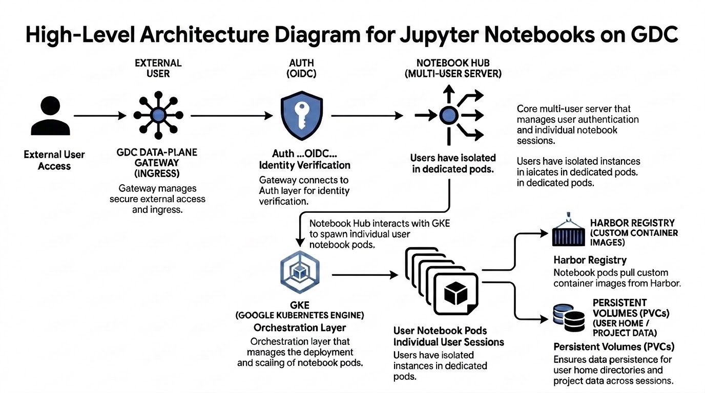

# Jupyter Notebooks on GDC Reference Architecture

## Overview

Jupyter Notebooks are the industry-standard environment for data science,
machine learning development, and collaborative research. This reference
architecture provides a scalable, horizontal notebook platform on Google
Distributed Cloud (GDC) to address the need for a multi-tenant environment. The
solution ensures continued platform usability by providing a blueprint-able
architecture that demonstrates best practices for deploying notebook services.

### Features & Capabilities

- **Multi-tenant Isolation:** Provides every project with its own isolated
  instance, ensuring robust security and per-tenant resource management.
- **Custom Image Support:** Enables users to bring and use arbitrary container
  images via integration with the Harbor registry.
- **Flexible Resource Allocation:** Allows users to select specific resource
  profiles (CPU, GPU, and RAM) at session startup.
- **Enterprise Security Integration:** Integrates with native GDC constructs and
  enterprise systems..

### Architectural Principles

- **Per-Project Isolation:** Maintain security and performance by provisioning
  dedicated instances for each project tenant.
- **Kubernetes-Native Design:** Leverage GKE on GDC to ensure a consistent,
  scalable, and manageable developer experience.
- **Flexibility and Control:** Prioritize the ability for customers to bring
  their own environments and custom resource profiles to meet diverse research
  needs.
- **Sustainability:** Design for a long-term, supportable path forward that
  aligns with upstream community standards.

## Architecture

## Concepts and Technologies

- **Notebook Hub:** The core multi-user server that manages user authentication
  and individual notebook sessions.
- **GKE (Google Kubernetes Engine):** The underlying orchestration layer that
  manages the deployment and scaling of notebook pods.
- **Harbor Registry:** A centralized repository for storing and managing custom
  Deep Learning container images.
- **Auth:** Provides identity and access management through OIDC integration.
- **Persistent Volumes (PVCs):** Ensures data persistence for user home
  directories and project data across sessions.
- **GDC Data-Plane Gateway:** Manages secure external access and ingress.

## Considerations

- **Scalability:** The architecture handles increasing workloads through
  horizontal scaling of individual user pods within GKE.
- **Resource Management:** Selection of hardware profiles allows for balancing
  performance requirements against available infrastructure costs.
- **Availability:** High availability is achieved by deploying components across
  multiple failure domains and using robust storage classes.
- **Operational Complexity:** While offering maximum flexibility, this
  self-managed model requires manual configuration of enterprise security
  standards compared to fully managed services.

## Design Decision

The core design decision is to deploy a platform as the primary horizontal
replacement for notebook services. This strategy was chosen to unblock
capability gaps by allowing customers to use custom images and blueprints while
leveraging the unique security and resource management features of GDC.

The following table outlines the four notebook delivery options evaluated for
GDC:

| Option                             | Managed Profile            | Multi-user | Target Persona                                                      |
| ---------------------------------- | -------------------------- | :--------: | ------------------------------------------------------------------- |
| **Self-managed JupyterHub**        | Self-managed (Platform)    |    Yes     | Organizations requiring full configuration control                  |
| **3rd Party Supported JupyterHub** | Vendor-supported (Partner) |    Yes     | Organizations requiring commercial support and regular CVE patching |
| **JupyterHub-as-a-Service**        | Google-managed Operator    |    Yes     | Enterprise multi-team organizations (Long-term strategy)            |
| **Single-user docker-stacks**      | Self-managed (Pod-based)   |     No     | Power users and individual prototyping                              |
| **Legacy Workbench**               | Google-managed             |    Yes     | Standard individual ML developers                                   |

The self-managed JupyterHub approach was selected as the strategic replacement
because it provides an immediate, community-aligned path for a centralized,
multi-tenant platform. This choice unblocks the critical need for custom image
support and granular resource control that were restricted in the legacy managed
service, while avoiding the extensive development lead time required for an
"as-a-service" operator.

## Assumptions and Limitations

- **Assumptions:** It is assumed that the GDC environment has existing network
  infrastructure and pre-configured security policies available for deployment.
- **Limitations:** The current solution requires manual configuration for
  authentication and ingress. It does not yet feature native GDC Console UI
  integration, requiring management via standard Kubernetes tools and Helm.

## Additional Resources

- [Jupyter Notebooks with JupyterHub on GDC-ag Reference Implementation](/docs/solutions/jupyter-notebooks/air-gapped/jupyterhub/reference-implementation.md)
